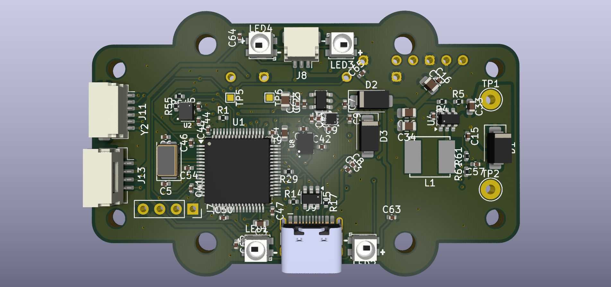
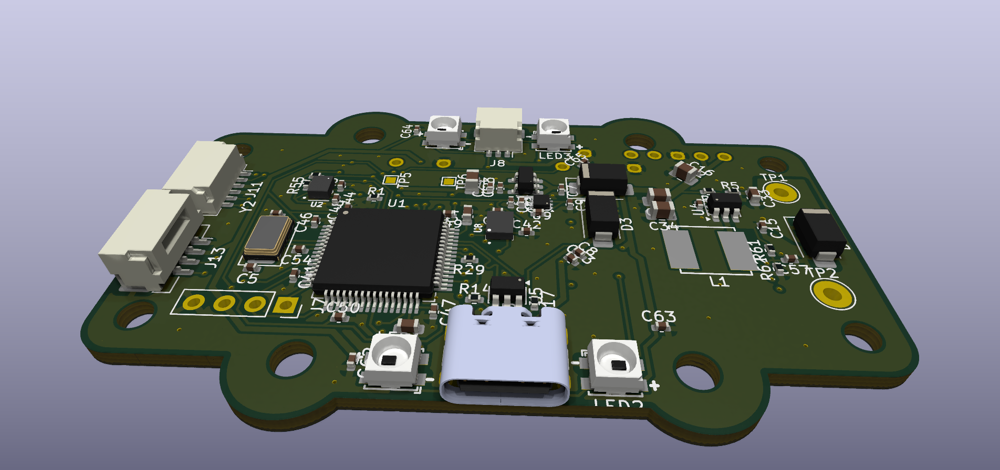
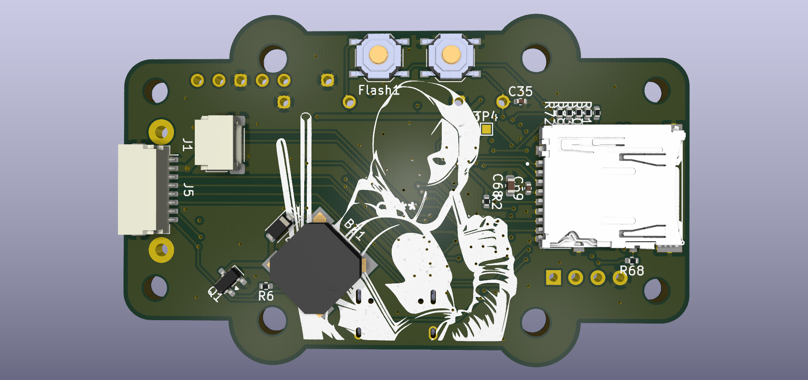
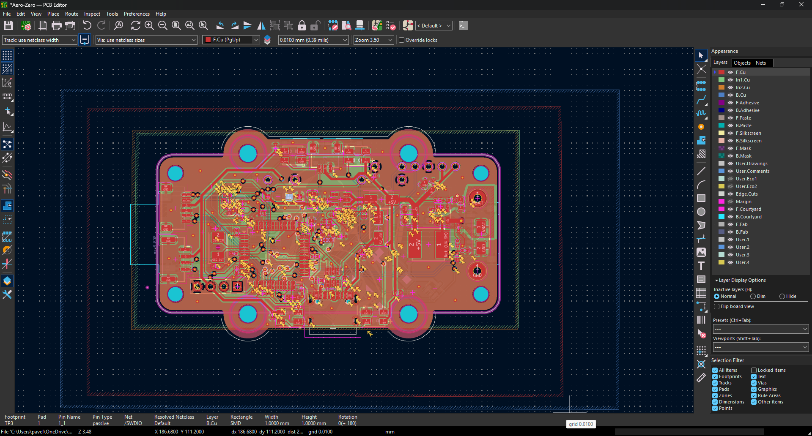
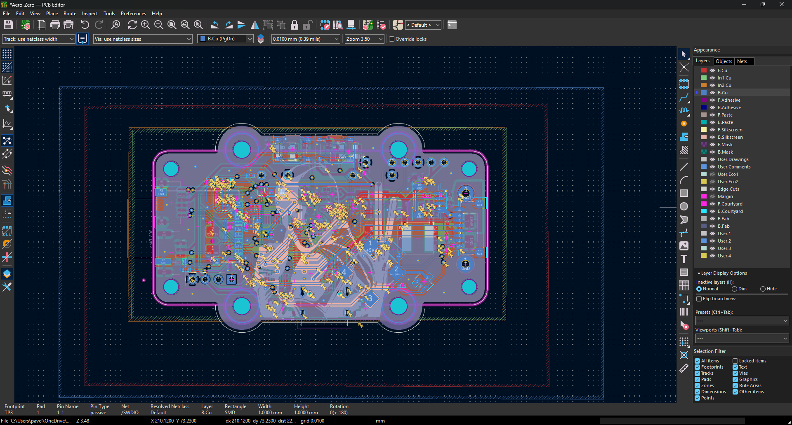
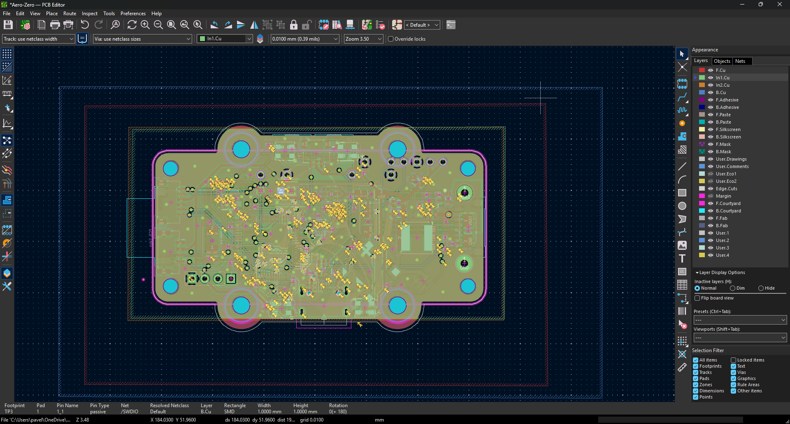
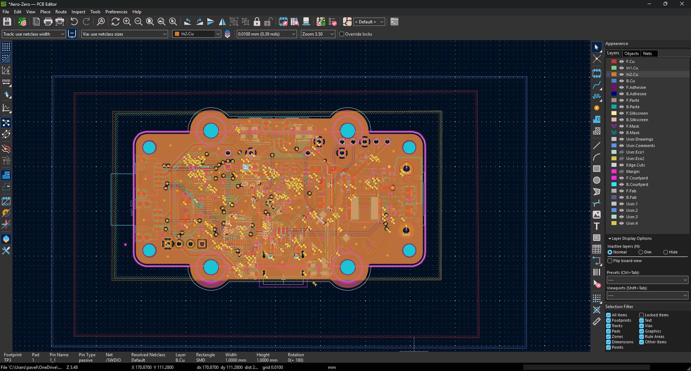
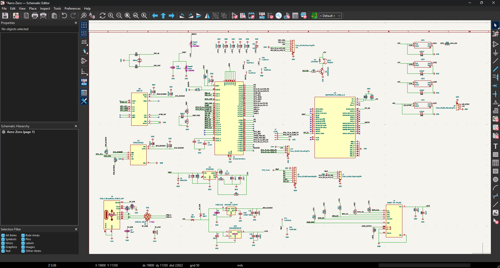

# Aero-Zero Custom Flight Controller

I started this project, because I wanted to build fully autonomous ai drone. When I looked at the flight controllers available on the market, they were full of hardware that I just do not need or just that I could not add things that I want (for example the Rasberry pi zero 2w) . Most boards also waste a lot of space on powering analog OSD chips, which is completely useless for me because I am flying a purely digital HD system like Walksnail Avatar. Because the technology changed and digital is the standard now, I realized it is just a waste of space to keep the analog stuff and massive connectors.

I am using Raspberry Pi Zero 2W as the computer. Firstly I wanted to use something more powerful to be able to run ai smoother, like allwinner cubie a7z, but it is more expensive and the biggest issue is the firmware and gpio programming on this device. I have no idea, how I would programm this device, when there are basically no manuals or datasheets to this, so I am using the basic raspberry pi zero 2w. So the most interesting thing on this pcb is the pi zero 2w, which is connected to the board by set of pins and screw holes that can be mounted on the pcb by screws.

The drone itself would be able to lift off and fly to a location based on the gps, there is the barometer, from which the drone gets the current altitude and can get to ground. I am using walksnail camera and elrs, plus LIDAR. There is a jst connector for led strip, while at the same time there are built in leds on the drone chassis, esc unit connector and built in electromagnetic buzzer and boot and rst buttons.

The first stage was actually studying the STM32 pinouts and figuring out as much possible of how modern flight controllers handle gyro SPI communication and high speed SDIO routing.

A custom mainboard designed to replace standard generic flight controllers. Built to handle Betaflight high speed kinematics and communicate directly with a Raspberry Pi Zero 2W. Designed entirely from scratch in KiCad 10.

## Project Features

* **Microcontroller:** STM32F407 (100-pin, 32-bit ARM Cortex-M4)
* **Stackup:** 4-Layer PCB (Signal / GND / GND+Power / Signal) for internal routing and better EMI shielding against switching inductors
* **IMU (Gyro):** Bosch BMI270 connected via dedicated hardware SPI1 bus for maximum signal integrity
* **Power:** VBAT main input with robust 5V switching regulator (TPS54302) and isolated 3.3V sensor rails
* **Connectivity:** USB-C for main communication with USBLC6 ESD protection, native Raspberry Pi UART interface
* **Digital Video:** Dedicated Walksnail/Caddx VTX JST-SH port (Analog OSD intentionally removed to save space)
* **Storage:** Integrated MicroSD slot (Hirose Push-Pull) routed via high-speed 4-bit SDIO bus for blackbox logging
* **Hardware Protections:** Strict 1:1 hardware pin layout for GPS and LiDAR connectors to prevent accidental voltage shorts during assembly

## Gallery

### 3D PCB Render

### PCB 

### Schematics

### Mechanical Integration

*(More PCB Routing and Schematic images will be added soon)*

---

## Bill of Materials (BOM)

| Component | Qty | Purpose / Description | Price (USD) | Link / Distributor |
| :--- | :---: | :--- | :--- | :--- |
| **Custom PCBA (Aero-Zero)** | 2 | Custom designed 4-layer STM32 flight controller board. Fully assembled via JLCPCB SMT. |  | JLCPCB |
| **Walksnail Avatar HD Pro Kit** | 1 | Digital HD Video Transmitter (VTX) and low-light camera system. (Dual Antenna, 32GB) | $157.88 | [Banggood](https://m.banggood.com/cs/Walksnail-Avatar-HD-Pro-Kit-Dual-Antennas-Version-5_8GHz-Digital-System-FPV-Transmitter-32GB-With-1-or-1_8-Inch1080P-160FOV-Camera-for-RC-Drone-p-2002088.html) |
| **GPS Module FLYWOO GOKU GM10 Mini V3** | 1 | Provides high-precision positioning data using the M10 chip for autonomous navigation, position hold, and return-to-home safety features. | $18.88 | [HobbyDrone.cz](https://www.hobbydrone.cz/cs/gps-module-flywoo-goku-gm10-mini-v3/) |
| **SpeedyBee BLS 60A 30x30 4-in-1 ESC** | 1 | Electronic Speed Controller (4-in-1) for driving the primary flight motors | $44.00 | [AliExpress](https://www.aliexpress.com/item/1005010400734832.html) |
| **EMAX ECO II 2207 1700KV Brushless Motor** | 4 | Primary propulsion system providing lift and flight dynamics for the drone chassis | $59.00 | [AliExpress](https://www.aliexpress.com/item/1005001706267138.html) |
| **Raspberry Pi Zero 2 W** | 1 | Secondary AI and computer vision processing unit for autonomous flight capabilities | $20.17 | [RPiShop (Czech Republic)](https://rpishop.cz/raspberry-pi-zero/4311-raspberry-pi-zero-2-w.html) |
